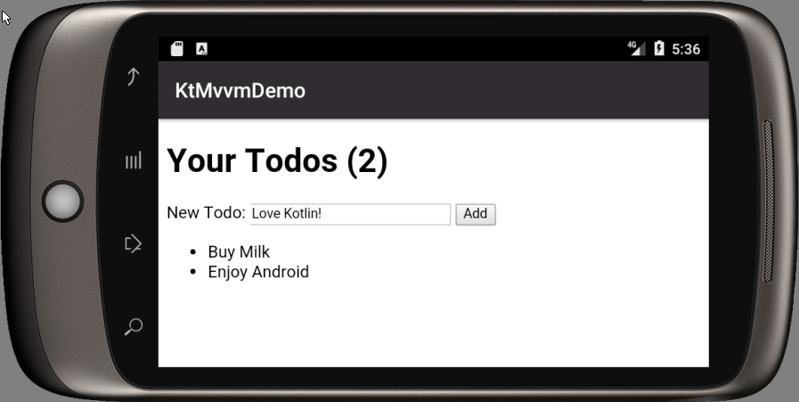
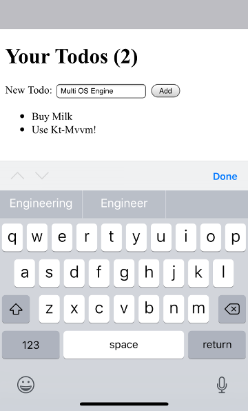
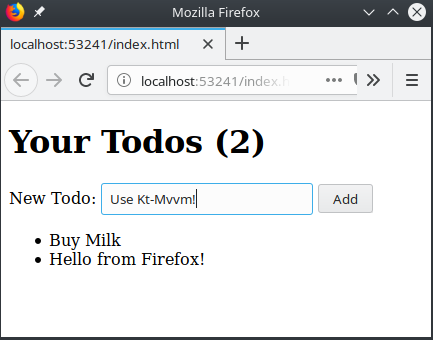

# Model View ViewModel for Kotlin

We love Kotlin. We love MVVM. This is the result.

The ViewModel:
```kotlin
class Demo : Model.Provider {
    override val objs = Model(this)

    var desc by observable("")
    val todos: MutableList<String> by observableList()

    val addTodo by action {
        todos += desc
        desc = ""
    }
}
```

The View:
```html
<label for="key">New Todo:</label>
<input id="key" type="text" data-bind="textInput: desc"/>
<button data-bind="click: addTodo">Add</button>
<ul class="todos" data-bind='foreach: todos'>
    <li>
        <span data-bind="text: $data"></span>
    </li>
</ul>
```

## Getting Started

Clone the demo [repository](https://github.com/dukescript/kt-mvvm-demo)
to give **Kotlin** and **MVVM** a try:
```bash
$ git clone https://github.com/dukescript/kt-mvvm-demo.git
$ cd kt-mvvm-demo
$ ./gradlew run # or: mvn package exec:exec
```
then edit the application logic or the application UI as
```bash
$ open src/main/java/com/kt/mvvm/demo/Demo.kt
$ open src/main/webapp/pages/index.html
```
and build and execute your application again to see outcome of your changes:
```bash
$ ./gradlew run
# or if you want to use Maven invoke:
$ mvn package exec:exec
```
Repeat until your application becomes as slick as needed!

## Documentation

Use [observable](./kt-mvvm/com.dukescript.api.kt/observable.html),
[observableList](./kt-mvvm/com.dukescript.api.kt/observable-list.html)
and [computed](./kt-mvvm/com.dukescript.api.kt/computed.html) functions to define intrinsic
well connected properties that together form [model(s)](./kt-mvvm/com.dukescript.api.kt/-model.html)
for your user interface, network communication, etc. Use
[action](./kt-mvvm/com.dukescript.api.kt/action.html)/[actionWithData](./kt-mvvm/com.dukescript.api.kt/action-with-data.html) to
define handlers of interactions arriving from the user interface, network or elsewhere.

Get the overall picture at the [KDoc](./kt-mvvm/com.dukescript.api.kt/index.html) for
the whole [Kotlin MVVM API](./kt-mvvm/com.dukescript.api.kt/index.html).

## Cross platform

With `kt-mvvm` you write your application once and deploy it to *desktop*, **Android**, **iOS** and *browser*
with the help of [portable presenters](https://github.com/dukescript/dukescript-presenters#readme).

### Android

The [sample project](https://github.com/dukescript/kt-mvvm-demo) comes
with classical Android Gradle `installDebug` task to package your application
as an Android `.apk` file and deploy it to your device or simulator:
```bash
$ ANDROID_HOME=/android-sdk/ ./gradlew installDebug
$ ls app/build/outputs/apk/
app-debug.apk
```


### iOS

One can package the [same code](https://github.com/dukescript/kt-mvvm-demo)
as an **iOS** `.ipa` file with the help of Intel's
[Multi OS Engine](https://multi-os-engine.org/) when running on Mac OS X.
First of all list your simulators and then use one of them to launch your 
application:
```bash
$ ./gradlew moeListSimulators
...
- DD9904B6-76CD-4F2D-9153-EC7182878897 - iOS 11.4 - iPhone X
...
$ ./gradlew moeLaunch -Pmoe.launcher.simulators=DD9904B6-76CD-4F2D-9153-EC7182878897
```



### Browser

The [same application](https://github.com/dukescript/kt-mvvm-demo)
can also be transpiled to JavaScript and executed in
the browser. The `bck2brwsrShow` tasks generates necessary `.js` files and
launches a browser with the application
```bash
$ ./gradlew bck2brwsrShow
...
Showing http://localhost:53241/index.html
...
$ ls -l web/build/web/
bck2brwsr.js
index.css
index.html
lib
main.js
```
The files in `web/build/web` directory
contain everything needed to execute your application and as such they can be
deployed to any HTTP server as a static content.
Read [more](https://github.com/jtulach/bck2brwsr/blob/master/docs/GRADLE.md).



With [Kotlin MVVM API](./kt-mvvm/com.dukescript.api.kt/index.html)
you can write your code once, deploy and display it everywhere
(*desktop* - `gradlew run`, *Android* - `gradlew installDebug`,
*iOS* - `gradlew moeLaunch`, *browser* - `gradlew bck2brwsrShow`) while
using the power of **Kotlin**, its libraries and any other *JVM libraries*
on every target platform.

## Connected Applications

`kt-mvvm` offers really smooth integration with REST backends - see
[loadJSON](./kt-mvvm/com.dukescript.api.kt/load-j-s-o-n.html) for more details.

## License

The `kt-mvvm` API is [licensed](https://github.com/dukescript/kt-mvvm/blob/master/LICENSE.md)
under *Apache 2.0* license. The default **JavaFX WebView** based
[presenter](https://github.com/apache/incubator-netbeans-html4j/#readme)
comes directly from an [Apache project](https://github.com/apache/incubator-netbeans-html4j/).
As such one can have fully functional system covered by benevolent *Apache license*.

[Alternative presenters](https://github.com/dukescript/dukescript-presenters#readme)
or [rendering environments](https://github.com/jtulach/bck2brwsr) come with their
own licensing terms.

Commercial support for the overall ecosystem is available via the
[DukeScript project](http://dukescript.com/#support) channels.
